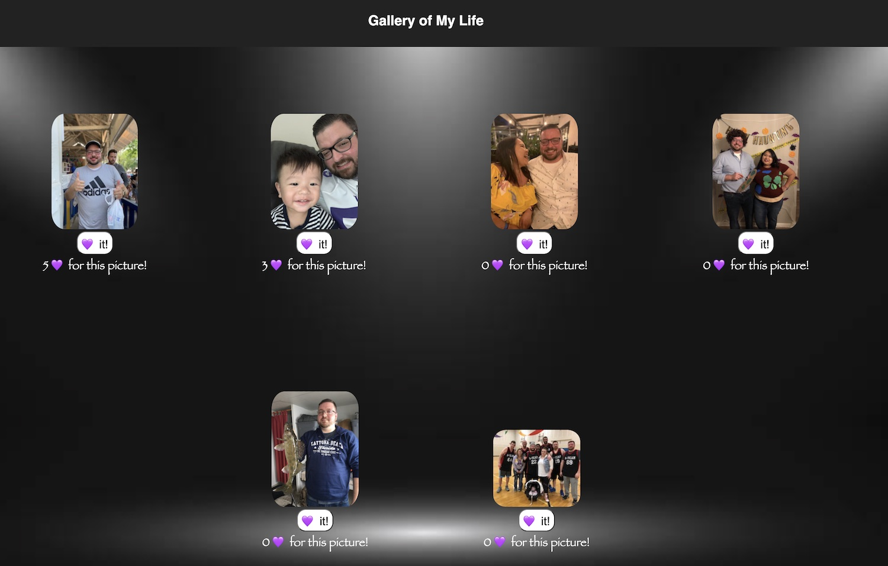

## React-Gallery
### Description
Duration: 4 day sprint
This project was a gallery of pictures and descriptions. Once we click on the photo the description will show and when the description is clicked the phot will return. To Achieve this there was a lot of communication through servers using Axios, handling props through components and some conditional rendering. The other feature to the project is the like button. When clicking the like button is keeps track of the amount of likes below the button. We needed the count of the likes to remain in the browser while refreshing the browser. This was achieved with using a PUT route and handling props through components. 
### Screen Shot
 
### Prerequisites
Link to software that is required to install the app (e.g. node).
•	Node.js
•	React
### Installation
1.	Open Visual Studio Code
2.	Run npm install
3.	Run npm run server in your terminal
4.	Add a second terminal and run npm run client.
5.	The npm run client command will open up a new browser tab for you!
 ### Usage
How does someone use this application? Tell a user story here.
1.	Open the app in a browser (preferably chrome)
2.	There will be some pictures showing.
3.	Click on the pictures to see the description of what that picture is.
4.	If you like picture, click on the heart button to like the picture. 
5.	The number of likes will show below the picture. 
### Built With
1.	Node modules
2.	React
3.	VS code
4.	useState
5.	CSS
6.	JavaScript
7.	Axios
### Acknowledgement
Thanks to Prime Digital Academy who equipped and helped me to make this application a reality. Also, thanks to my classmates for being a great resource for knowledge and support.
### Support
If you have suggestions or issues, please email me at Nick.Ilacqua@yahoo.com
